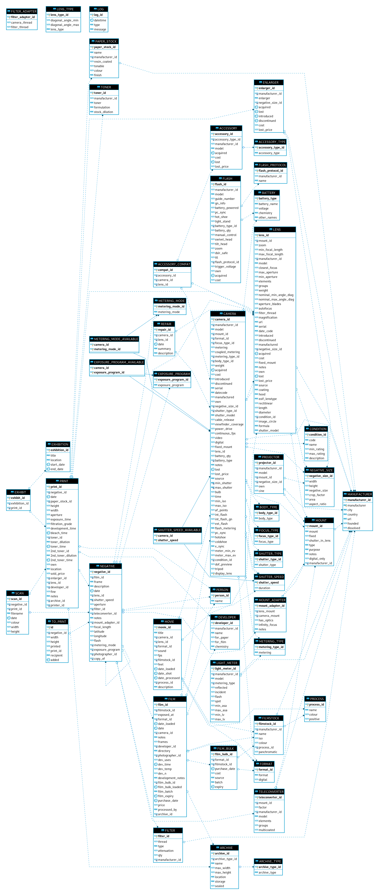

# Contributing to PhotoDB

## Background

PhotoDB is designed to be a normalised relational database to track different aspects of photography.
The application is designed to shield the user from the sharp edges that exist when updating
multiple database tables at once.

* Commits should be atomic, i.e. complete within themselves. If you make a change to the schema that requires a change to the application and/or documentation, they should be in the same commit.
* Documentation should be kept up to date with the project. Database schema docs are generated automatically but application usage documentation needs to be written by hand.
* CI tests need to be passing before a pull request will be accepted. At the moment this is just a syntax check but I hope to expand the tests in the future.

## Database conventions

* Tables should be given names in UPPERCASE
* Views should be given names in LOWERCASE
* Views whose name starts `choose_` are specifically for use with the `listchoices()` function

### Altering the schema

This section describes how to alter the schema, and document the changes.

Make your edits to the schema using any tool you prefer (I like MySQL Workbench). Then use
the included Perl script `dump-schema.pl` to export the dump files in the right format.

You'll need the following CPAN modules on your system:
 * `Getopt::Long`
 * `Term::ReadKey`
 * `DBI`
 * `DBD::MySQL`

`Getopt::Long` seems to be standard in the Red Hat distribution of Perl but you'll need
to install the others by doing:

```
yum install perl-TermReadKey perl-DBI perl-DBD-MySQL
```

Change into the working directory of the script and do the following:

```
./dump-schema.pl --hostname 192.168.0.1 --database photography --username joebloggs

# Default values:
# hostname = localhost
# database = photography
# username = whoever is currently logged in
```

The script **will delete all existing SQL dump files and write them out again**. Do not run
this in random paths on your system!

After running the script, check which files have been added, removed or changed, and then commit
the diffs with a meaningful commit message.

## Entity relationship diagram



## Application conventions

The application frontend, `photodb`, is the smallest possible script to determine which command
the user wants to run, map the command to a handler using `commands.pm` and then execute the
handler from `handlers.pm` to complete the user interaction.

Handlers are pieces of code which carry out user interaction, and encode logic about what information
to collect. They tend to be simple but extensive. Most handlers simply run through a list of prompts to
build a hash of data, which is then inserted/updated/etc into the database backend. Some handlers
contain simple logic to make decisions or loops to simplify bulk operations.

Handlers rely on functions in `funcs.pm` which are reusable pieces of code which do not interact
with the user, but perform common operations like selecting from a database, validating user input,
etc.

## Contributing your work

Pull requests are welcome.
